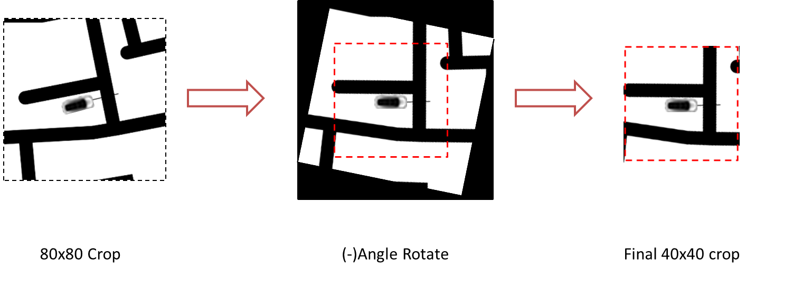

# myGymEnvs

My attempt to create openai gym based environments.
**Note**: this environment was created to solve the final assignment of TSAI EVA1 program. [theschoolofai.in](https://theschoolof.ai/)


`gym_dabbewala/envs/dabbewala_env.py` : is the environment, can be modified if wished.

`test_env.py`: file to test environment modifications.

## Environment:

Reasons to create the environment:

1. It's fun.
2. Gives better understanding on how most RL algorithms work

The environment code has been commented well, however below is some basic overview in the context of solving the assignment problem.

Render: is done using `pygame`. Install it if not already(setup.py may help)

### States

The Environment has two states:

#### State1: The Vision State

- This state is generated from the ***40x40 Angled Crop*** of the Road image keeping the car in the center.
- Angled crop represents the current vision state of the car perfectly.

- Feed this vision state to a CNN and get some embedding and feed into the RL algorithm of your choice.
- example has more details on that.


**NOTE**: Car is for representation purpose only, car is not part of the surrounding crop.

  


#### State2:
- Second part of the state contains a vector of:
  `[distance, orientation, -orientation, angle, angle]`
- Using state values can be an overkill, see which of these help you train a better RL model.

- State1(or some CNN embedding of it) and State2 can be concatenated and fed as final states.

### Actions

Continuous Action Space, with two actions with range [-20,20]

**Roatation:** is the predicted rotation angle for the car to take a turn.

**Speed**: action range is squeezed between [3,6], to make the car always run.(was completely unnecessary)

### Reward and done condition

Reward:
```python
        if the car is on the sand:
            reward = -1.5
        else: # being on road
            reward = -0.6
            if distance < last_distance:
                reward = -0.01
                
```
Positive reward only when car finished the final delivery.

Done:
1. When car picks up the object and delivers.
2. When Episode is over

